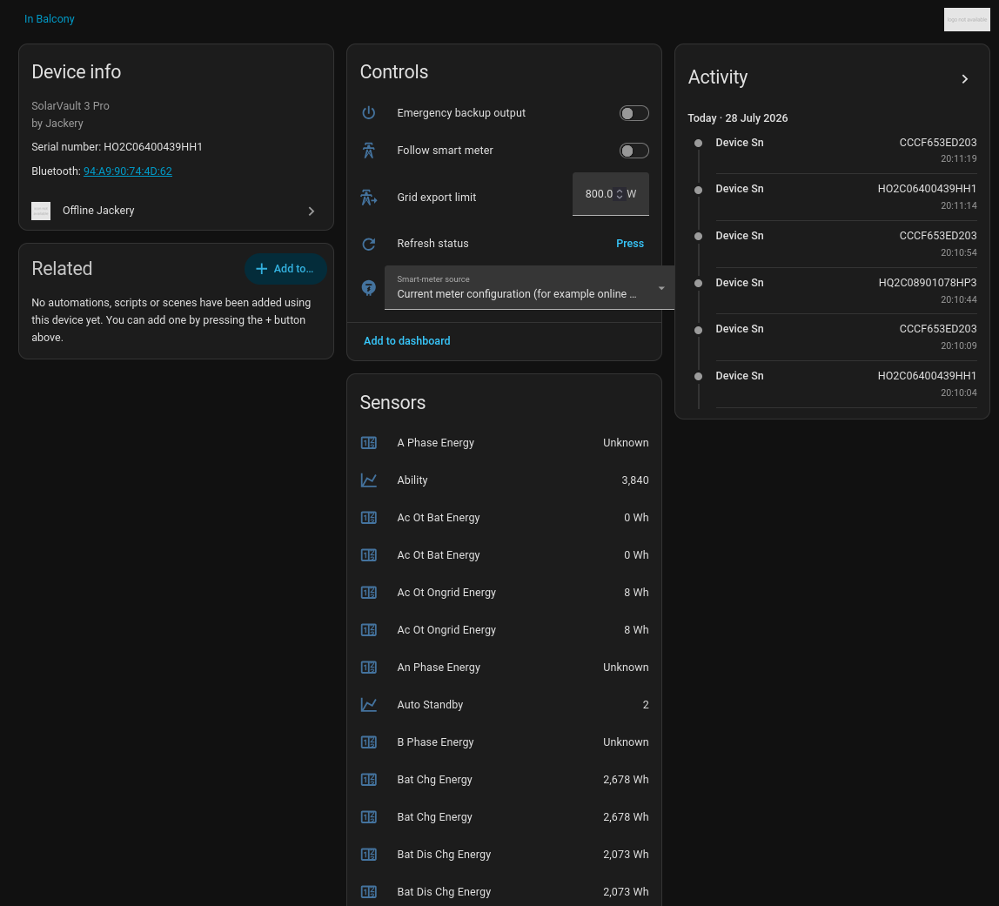
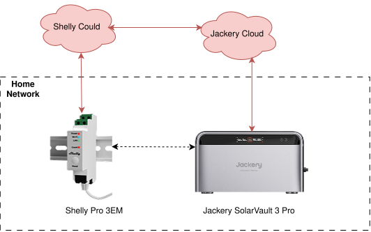
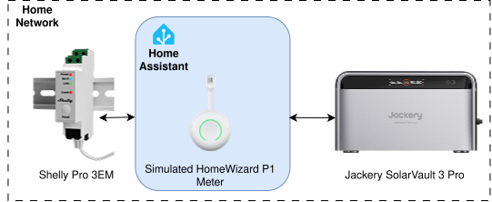
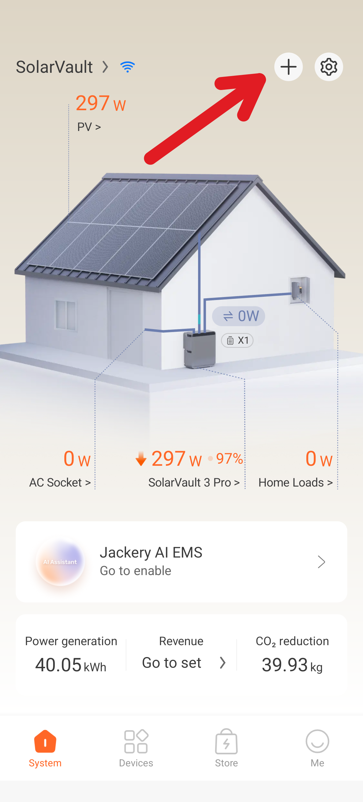
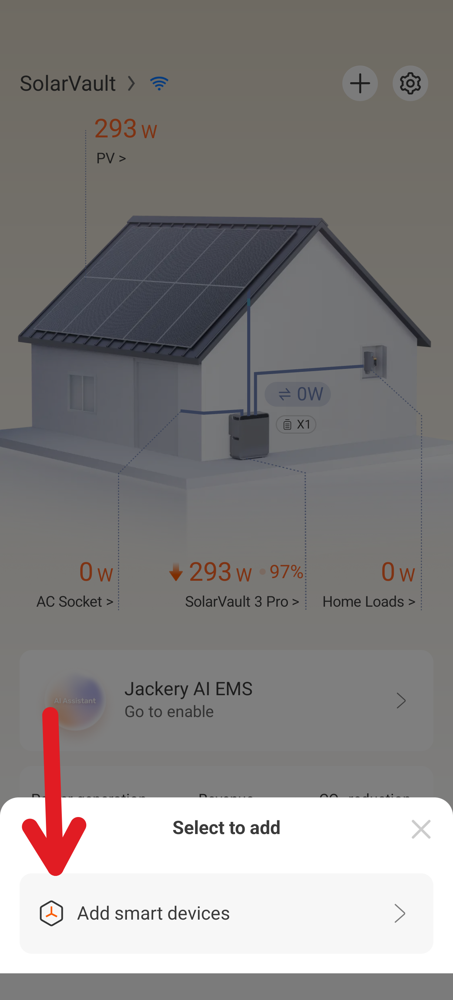
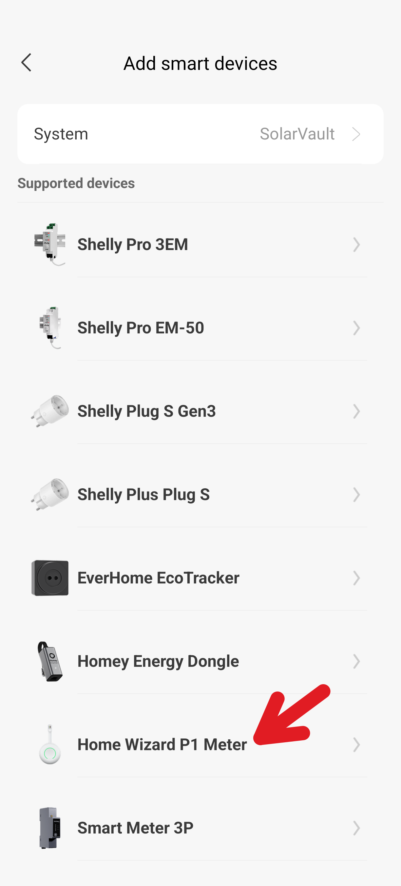
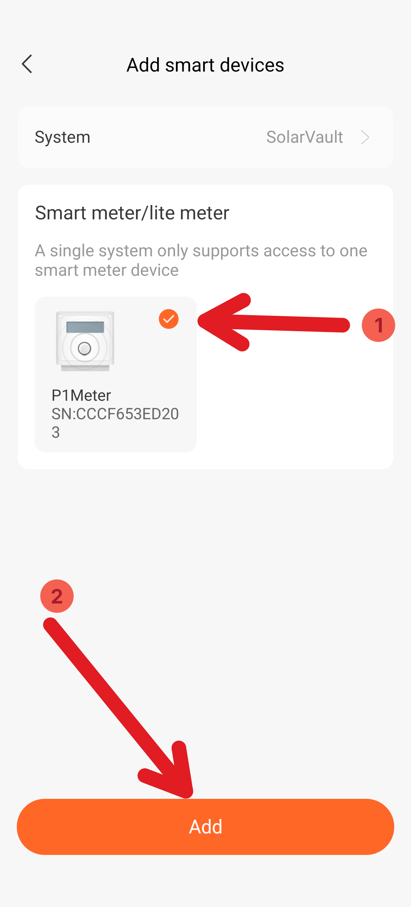
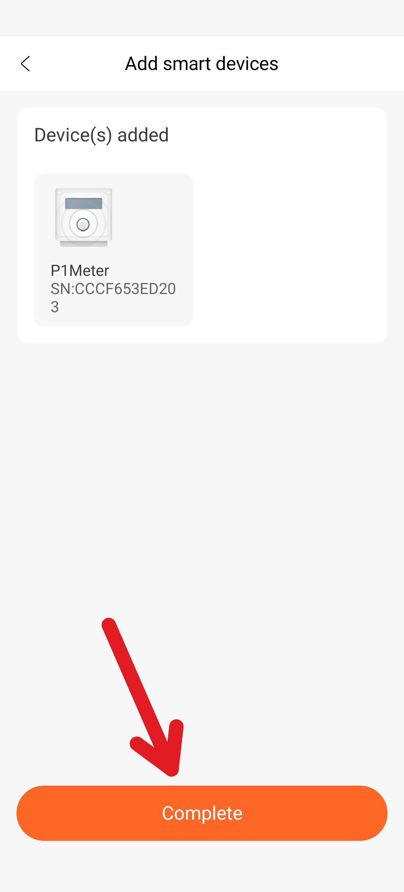
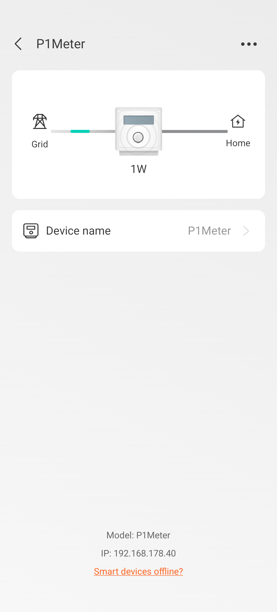

# Offline Jackery

Do you also want to be able to run your Jackery battery completely offline without any dependance on any cloud that could go down?

Well, then this Home Assistant integration is just for you!
Jackery cloud access is used only during initial setup to obtain the device-specific Bluetooth key; normal operation is completely local.

> [!WARNING]
> This integration is experimental. Commands affecting EPS output or grid export
> can affect attached equipment and regulatory compliance. Test cautiously.
>
> This project is based on reverse engineering and is not affiliated with or supported by Jackery.

## Features

### Diret Bluetooth Connection

Connects directly over Bluetooth Low Energy to your device. You can read out all key properties and even set most of them!



### Offline Mode For Shelly Pro 3EM

Up until now if you had a [Shelly Pro 3EM](https://www.shelly.com/products/shelly-pro-3em-x1) and wanted to add it to your Jackery device you had to:
1. Register it with your Shelly Cloud (booo!).
2. Link your Shelly Cloud account with your Jackery Cloud account (double booo!).

You were unable change anything since the Jackery app always went through the Jackery/Shelly Cloud. Yes, there is some kind of "offline fallback mode" where the Jackery battery talks direktly to the Shelly, but still cloud!!!!

|        |       |       |
| ------ | ----- | ----- |
| **Before** |  | You need your Shelly and Jackery Cloud to be linked for it to work. |
| **After**  |  | Home Assistant simulates a local [HomeWizard P1 Meter](https://www.homewizard.com/de-at/p1-meter/) which your battery can connect to directly without requiring a cloud. |

This is not acceptable

## Supported Devices

* [Jackery SolarVault 3 Pro](https://de.jackery.com/products/solarvault-3-pro)  (`HOME_011`, model code `3001`)
* [Shelly Pro 3EM](https://www.shelly.com/products/shelly-pro-3em-x1)

I'm open to support more devices. Those are just the ones I have access to and was able to validate my code on. Feel free to create an issue/merge request if you were able to get it running on more devices than those listed above.

## Installation with HACS

1. In HACS, open **Custom repositories**.
2. Add `https://github.com/COM8/offline-jackery` as an **Integration** repository.
3. Download **Offline Jackery** and restart Home Assistant.
4. Go to **Settings → Devices & services → Add integration** and select **Offline Jackery**.

## Setup

The configuration wizard asks for the Jackery account login mode, account, password, and (for email accounts) two-letter region code. The password and session token are used only in memory and are not stored. After login:

1. Select a SolarVault system from the account.
2. Let Home Assistant scan for its Bluetooth advertisement.
3. Select the matching serial-number result.
4. The wizard validates the key by connecting and reading initial telemetry.

The Bluetooth key and selected Bluetooth address are stored in Home Assistant's config-entry storage. Protect Home Assistant backups and its `.storage` directory, because Home Assistant does not provide a general encrypted secret store for config-entry values.

## Local Shelly Pro 3EM <-> HomeWizard P1 Meter Bridge

You can add a Shelly Pro 3EM <-> HomeWizard P1 Meter bridge from the same integration:

1. In Home Assistant go to `Settings` -> `Devices & services` -> `Offline Jackery` -> `Add device` and choose `Local Shelly Pro 3EM <-> HomeWizard P1 Meter bridge`.
2. Enter the Shelly's local address and the Home Assistant host's LAN IPv4 address. The latter must be reachable by your Jackery device.
3. Keep the generated virtual meter serial and use HTTP port **80**. HomeWizard API v1 defines port 80; a non-standard port may be discovered by the Jackery app but subsequently reported offline by your Jackery device.
4. Once added open your Jackery app and add your fake `HomeWizard P1 Meter` there. (I know! It looks like this is possible via Bluetooth without the app but I was not yet able to get it working.)

|     |     |
| --- | --- |
|  | Click on the `+` on the top right. |
|  | Click on `Add smart devices`. |
|  | Click on `Home Wizard P1 Meter`. |
|  | Your fake device should show up, select it and click on `Add`. |
|  | Click on `Complete`. |
|  | Under `Devices` in your Jackery app, you should be able to find the device and see the current power flow. |

Each entry polls only the Shelly's local Gen2 RPC API, serves HomeWizard API v1 over HTTP, and advertises `_hwenergy._tcp.local.` with the complete HomeWizard TXT metadata. No Shelly or Jackery cloud is involved after initial setup. If the Shelly uses authentication, its password is stored in Home Assistant's config-entry storage. Keep Home Assistant, the Shelly, and SolarVault on the same trusted LAN/VLAN; this emulated HomeWizard endpoint is intentionally unauthenticated.

### Experimental Jackery Smart Meter 3P discovery mock

The separate **Jackery Smart Meter 3P discovery mock** choice advertises a provisional `_jackery_power._tcp.local.` identity backed by a Shelly Pro 3EM. Automated tests cover the advertisement and its withdrawal; two-host LAN resolution remains untested. App recognition, SolarVault binding, and live 3P readings remain unverified. The reserved `/api/measurement` path returns HTTP 503 while its response format awaits a sanitized capture from a real 3P.

To try LAN discovery, enter the Shelly's local address, the Home Assistant host's reachable LAN IPv4 address, a virtual serial, a hexadecimal bind key no greater than `7FFFFFFF`, and port 80. The app parses the key as a signed 32-bit integer; larger keys can crash its discovery scan. Existing discovery-only entries with oversized keys receive a new provisional key during migration. The bind key is advertised on the LAN; generate a new value and never reuse an account or physical device secret. Browse `_jackery_power._tcp.local.` from another host and check service resolution separately from whether the Jackery app lists the mock. The app may require the serial to pass its `device/accessories/exists` cloud lookup. Home Assistant diagnostics report **discovery only** even when Shelly readings are fresh. The 3P entry stays out of the P1 smart-meter source selector and P1 Bluetooth bind service.

## Operation

Home Assistant refreshes the device every five seconds while it is reachable.
If Bluetooth disconnects, the integration reconnects using exponential backoff, capped at 64 seconds. The standard Home Assistant entity update action can be used for an immediate refresh, and the **Refresh status** button bypasses reconnect backoff.

The currently verified writable entities are:

- **Off-grid / EPS output** switch
- **Smart-meter power following** switch
- **Maximum grid feed-in power** number (0 to the reported device maximum, in
  10 W increments)

The grid feed-in setting is a ceiling, not an instantaneous power target. Actual export still depends on PV production, battery state, local load, metering, and firmware safety rules.

Enable debug logging temporarily with:

```yaml
logger:
  logs:
    custom_components.offline_jackery: debug
```

## Development

Open this repository in the supplied dev container, then run:

```bash
scripts/setup
scripts/develop
```

Lint and test with:

```bash
scripts/lint
pytest
```

## Reverse Engineering

1. Download the [`Jackery`](https://play.google.com/store/apps/details?id=com.hbxn.jackery) app from the Google Play Store. For this, you can use, for example [APK Pure](https://apkpure.com/de/jackery/com.hbxn.jackery).
2. Once downloaded unzip the downlaoded file.
3. Once you have the APK, you can also use [JADX](https://github.com/skylot/jadx). Most of the code is written in Java/Kotlin, which will not be able to be decompiled from Java byte code nicely.

Once decompiled use your favourite (local) LLM and tell it to make sense out of all this (partially) obfuscated Java code.
